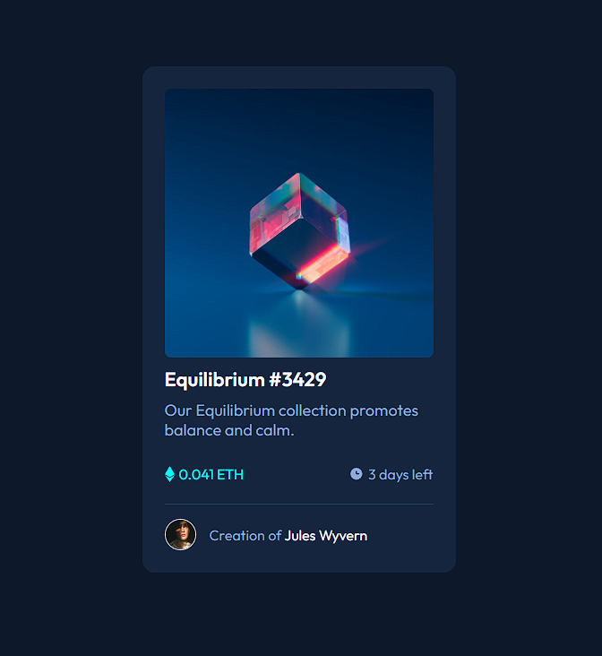
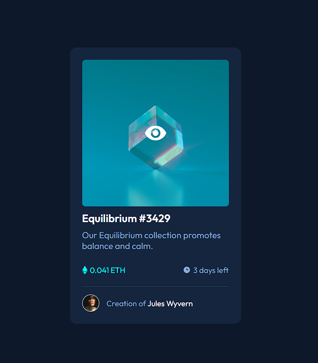

# Frontend Mentor - NFT preview card component solution

This is a solution to the [NFT preview card component challenge on Frontend Mentor](https://www.frontendmentor.io/challenges/nft-preview-card-component-SbdUL_w0U).

## Overview

### Screenshot

The project is a simple page, with a card showing a preview of a NFT for sale.

### Links

- Solution URL: [NFT preview](https://nft-preview-card-wall.netlify.app)

## My process

### Built with

- HTML5
- CSS custom properties
- Flexbox
- CSS Grid

### What I learned

The main thing I learned, in addition to improving my skills, was how to use ::before and ::after to apply with :hover in css, phasing the mouse hover effect

## Author

- Github - [Wallison Viana](https://github.com/7Wall)
- Frontend Mentor - [@7Wall](https://www.frontendmentor.io/profile/7Wall)
