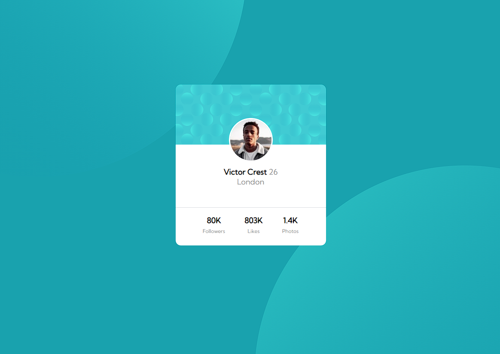

# Frontend Mentor - Profile card component solution

This is a solution to the [Profile card component challenge on Frontend Mentor](https://www.frontendmentor.io/challenges/profile-card-component-cfArpWshJ).

## Overview

### Screenshot

The challenge is to build a profile card using html and css

### Links

- Solution URL: [Profile Card](https://profile-card-wall.netlify.app)

## My process

### Built with

- HTML5
- CSS
- Flexbox

### What I learned

During the challenge I improved my design notions and learned how to use background images and colors to make the project more attractive.

## Author

- Github - [Wallison Viana](https://github.com/7Wall)
- Frontend Mentor - [@7Wall](https://www.frontendmentor.io/profile/7Wall)
