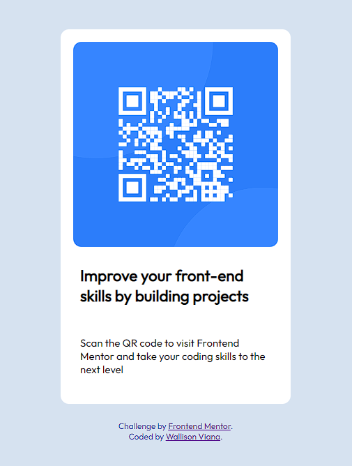

# Frontend Mentor - QR code component solution

This is a solution to the [QR code component challenge on Frontend Mentor](https://www.frontendmentor.io/challenges/qr-code-component-iux_sIO_H).

## Overview

### Screenshot

This was the site's first project, a small test with the basics of html and css

### Links

- Solution URL: [Qr Code card](https://ubiquitous-smakager-cde7f2.netlify.app)

## My process

### Built with

- HTML5
- CSS custom properties
- Flexbox

### What I learned

This project gave me the initial experience of making a project as close as possible to the requested design.

## Author

- Github - [Wallison Viana](https://github.com/7Wall)
- Frontend Mentor - [@7Wall](https://www.frontendmentor.io/profile/7Wall)
