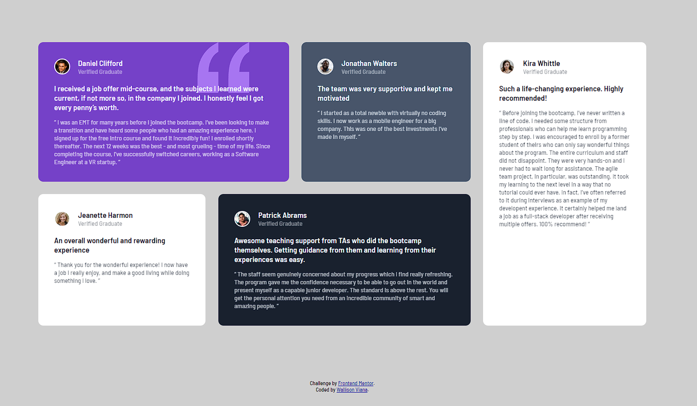

# Frontend Mentor - Testimonials grid section solution

This is a solution to the [Testimonials grid section challenge on Frontend Mentor](https://www.frontendmentor.io/challenges/testimonials-grid-section-Nnw6J7Un7). 

## Overview

### Screenshot

The project consists of a small page with a section of testimonials arranged in a grid.

### Links

- Solution URL: [Testimonial grid](https://testimonial-grid-section-wall.netlify.app)

## My process

### Built with

- HTML5
- CSS
- Flexbox
- CSS Grid

### What I learned

This was an interesting one to do, since at the time I made it I still didn't know the grid concepts and it required a lot of research and learning to learn during the completion of it.

In addition, I trained my knowledge with @media to create it with responsiveness.

## Author

- Github - [Wallison Viana](https://github.com/7Wall)
- Frontend Mentor - [@7Wall](https://www.frontendmentor.io/profile/7Wall)
